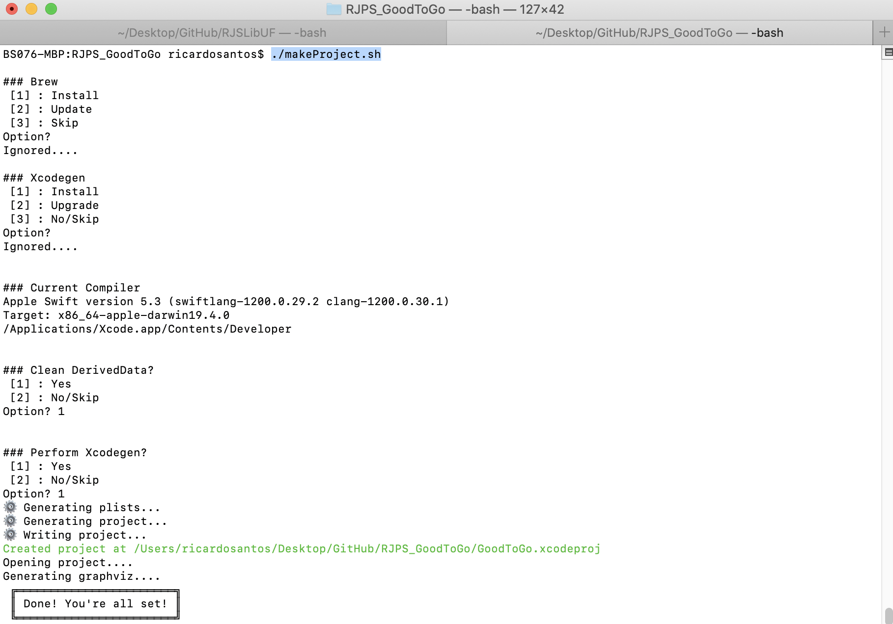
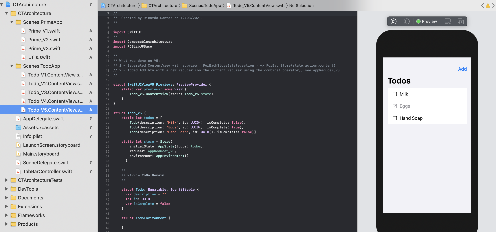

# RJS_CTArchitecture

   
    
   
    
   

## Install

No need to install anything, since the dependencie manager is SPM.

However, the project can all be rebuilt with `./makefile.sh` (for a total clean up of conflits fixing) using [XcodeGen](https://ricardojpsantos.medium.com/avoiding-merge-conflicts-with-xcodegen-a0e2a1647bcb).

## About

My notes on [The Composable Architecture
](https://github.com/pointfreeco/swift-composable-architecture)

Contains 2 simple apps, both with incrementar version (v1, v2, v3) and previews on each version.

---

__`Scenes.PrimeApp`__ is my walkthrough on:

* https://www.pointfree.co/collections/composable-architecture/swiftui-and-state-management/ep65-swiftui-and-state-management-part-1

* https://www.pointfree.co/collections/composable-architecture/swiftui-and-state-management/ep66-swiftui-and-state-management-part-2

* https://www.pointfree.co/collections/composable-architecture/swiftui-and-state-management/ep67-swiftui-and-state-management-part-3

* https://www.pointfree.co/collections/composable-architecture/swiftui-and-state-management/ep65-swiftui-and-state-management-part-1

__`Scenes.TodoApp`__ is my walkthrough on:

* https://www.pointfree.co/collections/composable-architecture/a-tour-of-the-composable-architecture/ep100-a-tour-of-the-composable-architecture-part-1

* https://www.pointfree.co/collections/composable-architecture/a-tour-of-the-composable-architecture/ep101-a-tour-of-the-composable-architecture-part-2

(in progress)

## To Do

Some docs